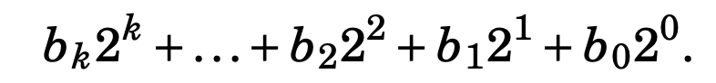

## BITWISE OPERATORS
Great for optimisation

##### Bit representation to a number

- decimal (divide by 2) to binary (summation of 2^k)
- opposite : 2's complement + 1

### Connection between a Signed and unsigned
- an unsigned int can contain any integer between 0 to 2^n-1
- a signed number -x == 2^n-x
```C++
int x=-43;
unsigned int y=x; // y = 4294967253
```
- In a signed representation the next number after 2^n-1 - 1 is -2^n-1 and in an unsigned int the next number after 2^n-1 -1 is 

```
n-1 because signed integers uses one bit for the sign. (signed integers: -2^n-1 to 2^n-1 -1) (the most significant bit, MSB), leaving n-1 bits for the magnitude of the number.
``` 

Here is the **binary representation** of numbers from 1 to 10:

| **Decimal** | **Binary Representation (4 bits)** |
|-------------|-------------------------------------|
| 1           | `0001`                              |
| 2           | `0010`                              |
| 3           | `0011`                              |
| 4           | `0100`                              |
| 5           | `0101`                              |
| 6           | `0110`                              |
| 7           | `0111`                              |
| 8           | `1000`                              |
| 9           | `1001`                              |
| 10          | `1010`                              |

### **Explanation**
1. **Binary Representation**: Binary is base-2, meaning each digit is a power of 2 (`2⁰`, `2¹`, etc.).
2. To convert decimal to binary:
   - Divide the number by 2.
   - Write down the remainder (0 or 1).
   - Repeat until the quotient is 0.
   - Read the binary number from bottom to top.

---

### Example Conversion: Decimal to Binary
#### **Convert 10 to Binary**
1. Divide by 2: \( 10 \div 2 = 5 \), remainder = 0.
2. Divide by 2: \( 5 \div 2 = 2 \), remainder = 1.
3. Divide by 2: \( 2 \div 2 = 1 \), remainder = 0.
4. Divide by 2: \( 1 \div 2 = 0 \), remainder = 1.

Write remainders from bottom to top: \( 1010 \).